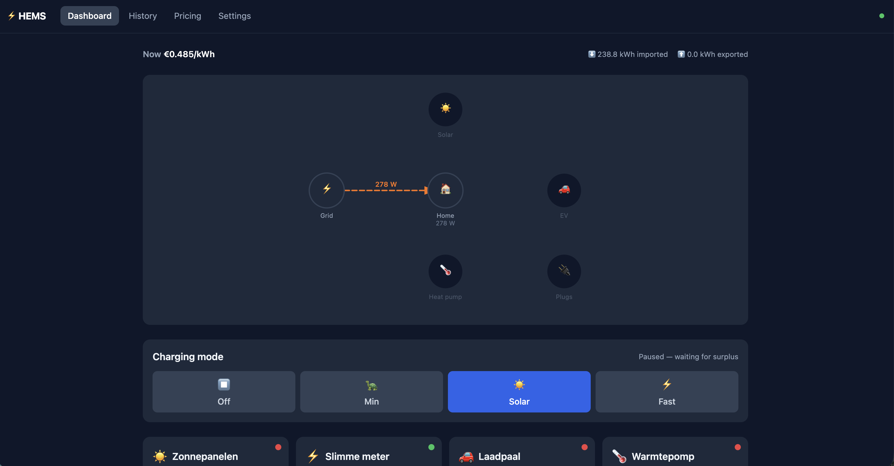

# HEMS — Home Energy Management System

An open-source, self-hosted home energy management system inspired by [evcc](https://evcc.io).
Local-first, privacy-respecting, and extensible via a single-file plugin architecture.



## Features

- **Real-time energy flow** — animated SVG diagram showing solar, grid, EV, heat pump and smart plug power
- **Solar surplus EV charging** — state machine that maximises self-consumption with hysteresis
- **Smart plug control** — binary on/off based on solar surplus
- **Day-ahead electricity prices** — ENTSO-E integration with all-in price calculation (markup + tax + VAT)
- **PV production forecast** — Open-Meteo irradiance + pvlib conversion, no API key required
- **Historical charts** — SQLite time-series, configurable range (1h → 30d)
- **Dynamic Settings UI** — adding a new hardware integration automatically generates its config form
- **Optional InfluxDB export** — write every poll to InfluxDB v2 alongside SQLite
- **Docker-ready** — single `docker compose up` to run everything

## Hardware supported

| Device | Type | Protocol |
|---|---|---|
| Enphase IQ Gateway | Solar | Local HTTPS + JWT |
| HomeWizard Energy P1 | Grid meter | Local REST |
| HomeWizard Energy Socket | Smart plug | Local REST |
| Shelly (Gen1 + Gen2+) | Smart plug | Local HTTP |
| Alfen Eve | EV charger | Modbus TCP |
| WeHeat Flint/Sparrow/Blackbird | Heat pump | Cloud OAuth2 |

## Quick start

### Docker (recommended)

```bash
# 1. Clone
git clone https://github.com/yourname/hems.git && cd hems

# 2. Configure
cp config.yaml.example config.yaml
# Edit config.yaml with your device IPs, tokens, etc.

# 3. Run
docker compose up -d

# Frontend → http://localhost
# Backend API → http://localhost:8000/docs
```

### Local development

**Backend:**
```bash
cd backend
python -m venv .venv && source .venv/bin/activate
pip install -r requirements.txt
cp ../config.yaml.example ../config.yaml
uvicorn main:app --reload
```

**Frontend:**
```bash
cd frontend
npm install
npm run dev
# → http://localhost:5173 (proxies /api and /ws to backend)
```

### Test an integration against real hardware

```bash
python tests/test_homewizard_p1.py 192.168.1.x
python tests/test_enphase.py 192.168.1.x eyJ...token
python tests/test_alfen_eve.py 192.168.1.x
python tests/test_shelly.py 192.168.1.x 2
python tests/test_weheat.py <client_id> <client_secret> <uuid>
```

## With InfluxDB

```bash
cp .env.example .env
# Set INFLUXDB_TOKEN in .env
docker compose -f docker-compose.yml -f docker-compose.influxdb.yml up -d
```

Then set `exports.influxdb.enabled: true` in `config.yaml`.

## Adding a new integration

Create one file in `backend/integrations/` and add one import to `main.py`.
See [docs/integrations/ADDING_NEW_INTEGRATION.md](docs/integrations/ADDING_NEW_INTEGRATION.md).

## Configuration reference

See [docs/configuration.md](docs/configuration.md) for all config.yaml options.

## API

Interactive API docs available at `http://localhost:8000/docs` when the backend is running.

Key endpoints:

```
GET  /api/v1/status                  Live device readings + charging state
WS   /ws/live                        WebSocket push every 5s
GET  /api/v1/history?range=24h       Time-series history
GET  /api/v1/pricing/today           Hourly electricity prices
GET  /api/v1/forecast                PV production forecast
GET  /api/v1/integration-types       Available plugin types
GET  /api/v1/integrations            Configured instances
PUT  /api/v1/charging/mode           Set charging mode
```

## Project structure

```
backend/
  integrations/   Plugin integrations (one file each)
  services/       Pricing, forecast, charging logic, InfluxDB
  api/            FastAPI route handlers
  models/         SQLModel DB models + Pydantic schemas
  main.py         FastAPI entrypoint
frontend/
  src/
    components/   Reusable UI components
    pages/        Dashboard, History, Pricing, Settings
    hooks/        useLiveData (WebSocket), useHistory (fetch)
docs/
  configuration.md
  integrations/ADDING_NEW_INTEGRATION.md
```

## License

MIT — see [LICENSE](LICENSE).
